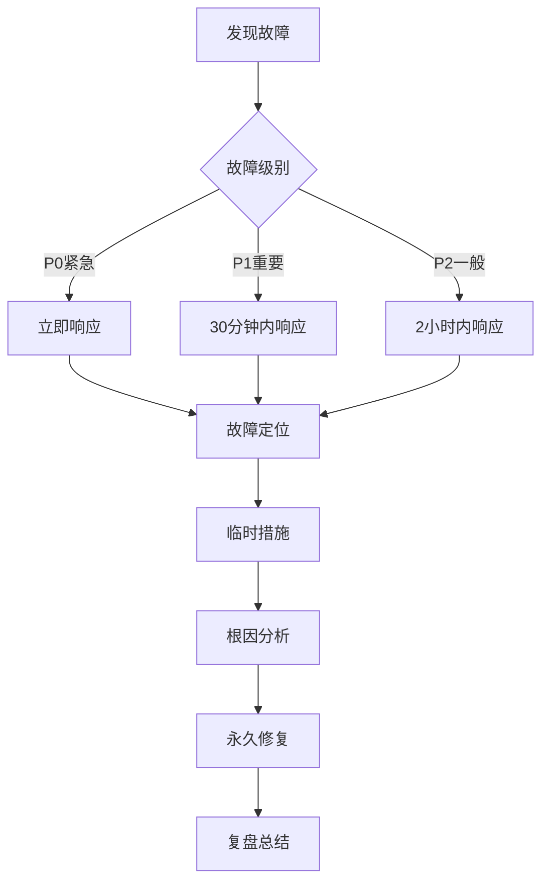

# Anker Eufy E28智能扫地机器人 "智能情报 + DAM + GEO + GEM + 智能决策沙盘"系统开发文档

**文档版本：** V1.0
**创建日期：** 2025年9月
**项目代号：** EIMS-DEV-2025
**技术负责人：** [待定]

## 1. 系统架构设计

### 1.1 总体架构

```
┌────────────────────────────────────────────────────────────┐
│                         前端应用层                          │
│  React SPA | Mobile App | Admin Portal | Partner Portal    │
├────────────────────────────────────────────────────────────┤
│                         API网关层                           │
│              Kong Gateway | 认证 | 限流 | 路由             │
├────────────────────────────────────────────────────────────┤
│                        微服务层                             │
│  ┌──────┐ ┌─────┐ ┌─────┐ ┌─────┐ ┌──────┐              │
│  │情报  │ │ DAM │ │ GEO │ │ GEM │ │沙盘  │              │
│  │服务  │ │服务 │ │服务 │ │服务 │ │服务  │              │
│  └──────┘ └─────┘ └─────┘ └─────┘ └──────┘              │
├────────────────────────────────────────────────────────────┤
│                       中间件层                              │
│   Redis | RabbitMQ | Elasticsearch | MinIO | Kafka        │
├────────────────────────────────────────────────────────────┤
│                       数据存储层                            │
│     MySQL | MongoDB | ClickHouse | HBase | HDFS           │
├────────────────────────────────────────────────────────────┤
│                     基础设施层                              │
│          Kubernetes | Docker | Prometheus | ELK            │
└────────────────────────────────────────────────────────────┘
```

### 1.2 技术选型

#### 1.2.1 前端技术栈

```javascript
// package.json 核心依赖
{
  "dependencies": {
    "react": "^18.2.0",
    "react-dom": "^18.2.0",
    "typescript": "^5.0.0",
    "@reduxjs/toolkit": "^1.9.0",
    "antd": "^5.0.0",
    "@ant-design/pro-components": "^2.4.0",
    "echarts": "^5.4.0",
    "axios": "^1.3.0",
    "react-router-dom": "^6.8.0",
    "dayjs": "^1.11.0",
    "@monaco-editor/react": "^4.5.0"
  }
}
```

#### 1.2.2 后端技术栈

```yaml
微服务框架:
  - Spring Boot 3.0 (Java服务)
  - FastAPI (Python服务)
  
编程语言:
  - Java 17 (核心业务)
  - Python 3.10 (AI/数据分析)
  - Go 1.20 (高性能组件)

数据存储:
  - MySQL 8.0 (关系型数据)
  - MongoDB 6.0 (文档型数据)
  - Redis 7.0 (缓存/会话)
  - MinIO (对象存储)
  - Elasticsearch 8.0 (搜索引擎)

消息队列:
  - Kafka 3.0 (事件流)
  - RabbitMQ 3.11 (任务队列)

容器化:
  - Docker 23.0
  - Kubernetes 1.27
  - Helm 3.11
```

### 1.3 网络架构

```yaml
网络规划:
  - VPC: 10.0.0.0/16
  - 公网子网: 10.0.1.0/24 (NAT网关、负载均衡器)
  - 应用子网: 10.0.10.0/24 (应用服务器)
  - 数据子网: 10.0.20.0/24 (数据库)
  - 管理子网: 10.0.30.0/24 (监控、日志)

安全组规则:
  - Web层: 80/443 (公网)
  - 应用层: 8080-8090 (内网)
  - 数据层: 3306/27017/6379 (应用层访问)
```

## 2. 数据库设计

### 2.1 核心数据模型

#### 2.1.1 智能情报模块

```sql
-- 监测任务表
CREATE TABLE ci_monitoring_tasks (
    id BIGINT PRIMARY KEY AUTO_INCREMENT,
    task_name VARCHAR(200) NOT NULL,
    target_type ENUM('competitor', 'keyword', 'market') NOT NULL,
    target_id VARCHAR(100) NOT NULL,
    monitoring_config JSON,
    frequency ENUM('realtime', 'hourly', 'daily', 'weekly'),
    alert_level ENUM('red', 'orange', 'yellow', 'green'),
    status ENUM('active', 'paused', 'deleted') DEFAULT 'active',
    created_by BIGINT,
    created_at TIMESTAMP DEFAULT CURRENT_TIMESTAMP,
    updated_at TIMESTAMP DEFAULT CURRENT_TIMESTAMP ON UPDATE CURRENT_TIMESTAMP,
    INDEX idx_target (target_type, target_id),
    INDEX idx_status (status)
) ENGINE=InnoDB DEFAULT CHARSET=utf8mb4;

-- 情报数据表
CREATE TABLE ci_intelligence_data (
    id BIGINT PRIMARY KEY AUTO_INCREMENT,
    task_id BIGINT NOT NULL,
    source VARCHAR(100),
    data_type VARCHAR(50),
    raw_data JSON,
    processed_data JSON,
    sentiment_score DECIMAL(3,2),
    importance_score INT,
    collected_at TIMESTAMP,
    processed_at TIMESTAMP,
    FOREIGN KEY (task_id) REFERENCES ci_monitoring_tasks(id),
    INDEX idx_task_time (task_id, collected_at)
) ENGINE=InnoDB DEFAULT CHARSET=utf8mb4;

-- 预警记录表
CREATE TABLE ci_alerts (
    id BIGINT PRIMARY KEY AUTO_INCREMENT,
    task_id BIGINT NOT NULL,
    alert_type VARCHAR(50),
    alert_level ENUM('red', 'orange', 'yellow', 'green'),
    title VARCHAR(500),
    content TEXT,
    data_snapshot JSON,
    status ENUM('pending', 'acknowledged', 'resolved'),
    created_at TIMESTAMP DEFAULT CURRENT_TIMESTAMP,
    acknowledged_at TIMESTAMP NULL,
    acknowledged_by BIGINT,
    resolved_at TIMESTAMP NULL,
    resolved_by BIGINT,
    FOREIGN KEY (task_id) REFERENCES ci_monitoring_tasks(id),
    INDEX idx_status_level (status, alert_level),
    INDEX idx_created (created_at)
) ENGINE=InnoDB DEFAULT CHARSET=utf8mb4;
```

#### 2.1.2 DAM资产管理模块

```sql
-- 资产主表
CREATE TABLE dam_assets (
    id BIGINT PRIMARY KEY AUTO_INCREMENT,
    asset_id VARCHAR(100) UNIQUE NOT NULL,
    asset_name VARCHAR(500) NOT NULL,
    asset_type ENUM('image', 'video', 'document', 'audio', 'other'),
    file_size BIGINT,
    file_path VARCHAR(1000),
    storage_type ENUM('local', 's3', 'minio'),
    mime_type VARCHAR(100),
    metadata JSON,
    tags JSON,
    category_path VARCHAR(500),
    version INT DEFAULT 1,
    status ENUM('draft', 'active', 'archived', 'deleted') DEFAULT 'active',
    created_by BIGINT,
    created_at TIMESTAMP DEFAULT CURRENT_TIMESTAMP,
    updated_at TIMESTAMP DEFAULT CURRENT_TIMESTAMP ON UPDATE CURRENT_TIMESTAMP,
    INDEX idx_type_status (asset_type, status),
    INDEX idx_created (created_at),
    FULLTEXT idx_search (asset_name, tags)
) ENGINE=InnoDB DEFAULT CHARSET=utf8mb4;

-- 资产版本表
CREATE TABLE dam_asset_versions (
    id BIGINT PRIMARY KEY AUTO_INCREMENT,
    asset_id VARCHAR(100) NOT NULL,
    version_number INT NOT NULL,
    file_path VARCHAR(1000),
    file_size BIGINT,
    change_log TEXT,
    created_by BIGINT,
    created_at TIMESTAMP DEFAULT CURRENT_TIMESTAMP,
    UNIQUE KEY uk_asset_version (asset_id, version_number),
    INDEX idx_asset (asset_id)
) ENGINE=InnoDB DEFAULT CHARSET=utf8mb4;

-- 资产使用记录表
CREATE TABLE dam_asset_usage (
    id BIGINT PRIMARY KEY AUTO_INCREMENT,
    asset_id VARCHAR(100) NOT NULL,
    used_by BIGINT,
    used_in VARCHAR(100),
    usage_type VARCHAR(50),
    usage_context JSON,
    performance_metrics JSON,
    used_at TIMESTAMP DEFAULT CURRENT_TIMESTAMP,
    INDEX idx_asset (asset_id),
    INDEX idx_used_at (used_at)
) ENGINE=InnoDB DEFAULT CHARSET=utf8mb4;
```

#### 2.1.3 GEO内容优化模块

```sql
-- 内容表
CREATE TABLE geo_contents (
    id BIGINT PRIMARY KEY AUTO_INCREMENT,
    content_id VARCHAR(100) UNIQUE NOT NULL,
    title VARCHAR(1000) NOT NULL,
    slug VARCHAR(500) UNIQUE,
    content_type ENUM('article', 'guide', 'review', 'faq', 'comparison'),
    content_body LONGTEXT,
    summary TEXT,
    target_keywords JSON,
    seo_metadata JSON,
    ai_optimization JSON,
    word_count INT,
    reading_time INT,
    status ENUM('draft', 'review', 'published', 'archived') DEFAULT 'draft',
    published_at TIMESTAMP NULL,
    author_id BIGINT,
    created_at TIMESTAMP DEFAULT CURRENT_TIMESTAMP,
    updated_at TIMESTAMP DEFAULT CURRENT_TIMESTAMP ON UPDATE CURRENT_TIMESTAMP,
    INDEX idx_status (status),
    INDEX idx_published (published_at),
    FULLTEXT idx_content (title, content_body)
) ENGINE=InnoDB DEFAULT CHARSET=utf8mb4;

-- SEO性能表
CREATE TABLE geo_seo_performance (
    id BIGINT PRIMARY KEY AUTO_INCREMENT,
    content_id VARCHAR(100) NOT NULL,
    date DATE NOT NULL,
    impressions INT DEFAULT 0,
    clicks INT DEFAULT 0,
    ctr DECIMAL(5,2),
    avg_position DECIMAL(4,1),
    organic_traffic INT DEFAULT 0,
    bounce_rate DECIMAL(5,2),
    avg_time_on_page INT,
    conversions INT DEFAULT 0,
    UNIQUE KEY uk_content_date (content_id, date),
    INDEX idx_date (date)
) ENGINE=InnoDB DEFAULT CHARSET=utf8mb4;
```

#### 2.1.4 GEM投放模块

```sql
-- 广告活动表
CREATE TABLE gem_campaigns (
    id BIGINT PRIMARY KEY AUTO_INCREMENT,
    campaign_id VARCHAR(100) UNIQUE NOT NULL,
    campaign_name VARCHAR(500) NOT NULL,
    platform ENUM('google', 'meta', 'amazon', 'microsoft', 'baidu', 'bytedance'),
    campaign_type VARCHAR(50),
    objective VARCHAR(100),
    budget DECIMAL(10,2),
    spend DECIMAL(10,2) DEFAULT 0,
    start_date DATE,
    end_date DATE,
    targeting_config JSON,
    bidding_config JSON,
    status ENUM('draft', 'active', 'paused', 'completed') DEFAULT 'draft',
    external_id VARCHAR(100),
    created_by BIGINT,
    created_at TIMESTAMP DEFAULT CURRENT_TIMESTAMP,
    updated_at TIMESTAMP DEFAULT CURRENT_TIMESTAMP ON UPDATE CURRENT_TIMESTAMP,
    INDEX idx_platform_status (platform, status),
    INDEX idx_dates (start_date, end_date)
) ENGINE=InnoDB DEFAULT CHARSET=utf8mb4;

-- 广告素材表
CREATE TABLE gem_creatives (
    id BIGINT PRIMARY KEY AUTO_INCREMENT,
    creative_id VARCHAR(100) UNIQUE NOT NULL,
    campaign_id VARCHAR(100) NOT NULL,
    creative_type ENUM('text', 'image', 'video', 'carousel', 'collection'),
    creative_content JSON,
    asset_ids JSON,
    performance_data JSON,
    status ENUM('active', 'paused', 'rejected') DEFAULT 'active',
    created_at TIMESTAMP DEFAULT CURRENT_TIMESTAMP,
    FOREIGN KEY (campaign_id) REFERENCES gem_campaigns(campaign_id),
    INDEX idx_campaign (campaign_id)
) ENGINE=InnoDB DEFAULT CHARSET=utf8mb4;
```

#### 2.1.5 决策沙盘模块

```sql
-- 模拟场景表
CREATE TABLE sim_scenarios (
    id BIGINT PRIMARY KEY AUTO_INCREMENT,
    scenario_id VARCHAR(100) UNIQUE NOT NULL,
    scenario_name VARCHAR(500) NOT NULL,
    scenario_type VARCHAR(50),
    base_parameters JSON,
    variables JSON,
    constraints JSON,
    created_by BIGINT,
    created_at TIMESTAMP DEFAULT CURRENT_TIMESTAMP,
    INDEX idx_type (scenario_type)
) ENGINE=InnoDB DEFAULT CHARSET=utf8mb4;

-- 模拟运行记录表
CREATE TABLE sim_runs (
    id BIGINT PRIMARY KEY AUTO_INCREMENT,
    run_id VARCHAR(100) UNIQUE NOT NULL,
    scenario_id VARCHAR(100) NOT NULL,
    input_parameters JSON,
    simulation_results JSON,
    metrics JSON,
    recommendations JSON,
    run_status ENUM('running', 'completed', 'failed'),
    started_at TIMESTAMP DEFAULT CURRENT_TIMESTAMP,
    completed_at TIMESTAMP NULL,
    FOREIGN KEY (scenario_id) REFERENCES sim_scenarios(scenario_id),
    INDEX idx_scenario (scenario_id),
    INDEX idx_status (run_status)
) ENGINE=InnoDB DEFAULT CHARSET=utf8mb4;
```

### 2.2 MongoDB集合设计

```javascript
// 情报原始数据集合
db.createCollection("raw_intelligence", {
  validator: {
    $jsonSchema: {
      bsonType: "object",
      required: ["source", "timestamp", "data"],
      properties: {
        source: { bsonType: "string" },
        timestamp: { bsonType: "date" },
        data: { bsonType: "object" },
        processed: { bsonType: "bool" },
        tags: { bsonType: "array" }
      }
    }
  }
});

// 内容版本历史集合
db.createCollection("content_versions", {
  validator: {
    $jsonSchema: {
      bsonType: "object",
      required: ["contentId", "version", "content"],
      properties: {
        contentId: { bsonType: "string" },
        version: { bsonType: "int" },
        content: { bsonType: "object" },
        changes: { bsonType: "array" },
        editor: { bsonType: "string" },
        savedAt: { bsonType: "date" }
      }
    }
  }
});

// 创建索引
db.raw_intelligence.createIndex({ "source": 1, "timestamp": -1 });
db.raw_intelligence.createIndex({ "processed": 1 });
db.content_versions.createIndex({ "contentId": 1, "version": -1 });
```

## 3. API接口设计

### 3.1 API规范

```yaml
API设计原则:
  - RESTful风格
  - 统一响应格式
  - 版本管理 (/api/v1/)
  - 认证授权 (JWT)
  - 限流控制
  - 错误处理
  - 分页排序
  - 字段过滤
```

### 3.2 核心接口定义

#### 3.2.1 智能情报API

```typescript
// 情报监测接口
interface IntelligenceAPI {
  // 创建监测任务
  POST /api/v1/intelligence/tasks
  Request: {
    taskName: string;
    targetType: 'competitor' | 'keyword' | 'market';
    targetId: string;
    config: MonitoringConfig;
    frequency: string;
    alertLevel: string;
  }
  Response: {
    code: number;
    data: {
      taskId: string;
      status: string;
    }
  }

  // 获取预警列表
  GET /api/v1/intelligence/alerts
  Query: {
    level?: string;
    status?: string;
    startDate?: string;
    endDate?: string;
    page?: number;
    size?: number;
  }
  Response: {
    code: number;
    data: {
      total: number;
      items: Alert[];
    }
  }

  // 确认预警
  PUT /api/v1/intelligence/alerts/{alertId}/acknowledge
  Response: {
    code: number;
    message: string;
  }

  // 获取情报报告
  GET /api/v1/intelligence/reports/{reportId}
  Response: {
    code: number;
    data: IntelligenceReport;
  }
}
```

#### 3.2.2 DAM资产API

```typescript
// 资产管理接口
interface AssetAPI {
  // 上传资产
  POST /api/v1/dam/assets/upload
  Headers: {
    'Content-Type': 'multipart/form-data'
  }
  Request: FormData {
    file: File;
    metadata: {
      name: string;
      type: string;
      tags: string[];
      category: string;
    }
  }
  Response: {
    code: number;
    data: {
      assetId: string;
      url: string;
    }
  }

  // 搜索资产
  GET /api/v1/dam/assets/search
  Query: {
    keyword?: string;
    type?: string;
    tags?: string[];
    performance?: string;
    page?: number;
    size?: number;
  }
  Response: {
    code: number;
    data: {
      total: number;
      items: Asset[];
    }
  }

  // 获取资产性能
  GET /api/v1/dam/assets/{assetId}/performance
  Response: {
    code: number;
    data: {
      usage: number;
      ctr: number;
      conversion: number;
      score: number;
    }
  }
}
```

#### 3.2.3 GEO内容API

```typescript
// 内容优化接口
interface ContentAPI {
  // 创建内容
  POST /api/v1/geo/contents
  Request: {
    title: string;
    type: string;
    content: string;
    keywords: string[];
    seoMeta: SEOMetadata;
  }
  Response: {
    code: number;
    data: {
      contentId: string;
      status: string;
    }
  }

  // SEO分析
  POST /api/v1/geo/contents/{contentId}/analyze
  Response: {
    code: number;
    data: {
      seoScore: number;
      aioScore: number;
      suggestions: string[];
      keywords: KeywordAnalysis[];
    }
  }

  // 发布内容
  POST /api/v1/geo/contents/{contentId}/publish
  Request: {
    channels: string[];
    scheduledAt?: string;
  }
  Response: {
    code: number;
    message: string;
  }
}
```

#### 3.2.4 GEM投放API

```typescript
// 广告投放接口
interface CampaignAPI {
  // 创建广告活动
  POST /api/v1/gem/campaigns
  Request: {
    name: string;
    platform: string;
    type: string;
    budget: number;
    targeting: TargetingConfig;
    creatives: Creative[];
  }
  Response: {
    code: number;
    data: {
      campaignId: string;
      status: string;
    }
  }

  // 优化建议
  GET /api/v1/gem/campaigns/{campaignId}/optimization
  Response: {
    code: number;
    data: {
      suggestions: OptimizationSuggestion[];
      predictedImpact: {
        ctr: number;
        conversion: number;
        roi: number;
      }
    }
  }

  // 批量操作
  POST /api/v1/gem/campaigns/batch
  Request: {
    action: 'pause' | 'resume' | 'delete';
    campaignIds: string[];
  }
  Response: {
    code: number;
    data: {
      success: string[];
      failed: string[];
    }
  }
}
```

#### 3.2.5 决策沙盘API

```typescript
// 模拟决策接口
interface SimulationAPI {
  // 创建模拟
  POST /api/v1/simulation/scenarios
  Request: {
    name: string;
    type: string;
    parameters: SimulationParams;
    variables: Variable[];
  }
  Response: {
    code: number;
    data: {
      scenarioId: string;
    }
  }

  // 运行模拟
  POST /api/v1/simulation/run
  Request: {
    scenarioId: string;
    inputs: any;
  }
  Response: {
    code: number;
    data: {
      runId: string;
      status: string;
    }
  }

  // 获取结果
  GET /api/v1/simulation/runs/{runId}/results
  Response: {
    code: number;
    data: {
      status: string;
      results: SimulationResults;
      recommendations: Recommendation[];
    }
  }
}
```

### 3.3 统一响应格式

```typescript
// 成功响应
{
  "code": 0,
  "message": "success",
  "data": {
    // 业务数据
  },
  "timestamp": 1679123456789
}

// 错误响应
{
  "code": 40001, // 错误码
  "message": "参数错误",
  "errors": [
    {
      "field": "email",
      "message": "邮箱格式不正确"
    }
  ],
  "timestamp": 1679123456789
}

// 分页响应
{
  "code": 0,
  "message": "success",
  "data": {
    "items": [...],
    "pagination": {
      "page": 1,
      "size": 20,
      "total": 100,
      "totalPages": 5
    }
  },
  "timestamp": 1679123456789
}
```

## 4. 核心模块实现

### 4.1 智能情报模块

#### 4.1.1 数据采集器

```python
# crawler/base_crawler.py
from abc import ABC, abstractmethod
import asyncio
import aiohttp
from typing import Dict, List
import logging

class BaseCrawler(ABC):
    """基础爬虫类"""
  
    def __init__(self, config: Dict):
        self.config = config
        self.session = None
        self.logger = logging.getLogger(self.__class__.__name__)
  
    async def __aenter__(self):
        self.session = aiohttp.ClientSession()
        return self
  
    async def __aexit__(self, exc_type, exc_val, exc_tb):
        await self.session.close()
  
    @abstractmethod
    async def fetch(self, url: str) -> Dict:
        """获取数据"""
        pass
  
    @abstractmethod
    async def parse(self, content: str) -> Dict:
        """解析数据"""
        pass
  
    async def run(self, urls: List[str]) -> List[Dict]:
        """批量采集"""
        tasks = [self.fetch(url) for url in urls]
        results = await asyncio.gather(*tasks, return_exceptions=True)
      
        valid_results = []
        for result in results:
            if not isinstance(result, Exception):
                parsed = await self.parse(result)
                valid_results.append(parsed)
            else:
                self.logger.error(f"采集失败: {result}")
      
        return valid_results

# crawler/amazon_crawler.py
class AmazonCrawler(BaseCrawler):
    """Amazon数据采集器"""
  
    async def fetch(self, url: str) -> Dict:
        headers = {
            'User-Agent': self.config['user_agent'],
            'Accept': 'text/html,application/xhtml+xml',
        }
      
        async with self.session.get(url, headers=headers) as response:
            content = await response.text()
            return {
                'url': url,
                'content': content,
                'status': response.status
            }
  
    async def parse(self, data: Dict) -> Dict:
        from bs4 import BeautifulSoup
      
        soup = BeautifulSoup(data['content'], 'html.parser')
      
        # 解析产品信息
        product = {
            'title': soup.find('span', {'id': 'productTitle'}).text.strip(),
            'price': self._parse_price(soup),
            'rating': self._parse_rating(soup),
            'reviews': self._parse_reviews(soup),
            'features': self._parse_features(soup),
            'timestamp': datetime.now().isoformat()
        }
      
        return product
  
    def _parse_price(self, soup):
        price_elem = soup.find('span', {'class': 'a-price-whole'})
        if price_elem:
            return float(price_elem.text.replace(',', '').replace('$', ''))
        return None
```

#### 4.1.2 情报分析引擎

```python
# analyzer/intelligence_analyzer.py
import pandas as pd
import numpy as np
from typing import Dict, List
from sklearn.ensemble import IsolationForest

class IntelligenceAnalyzer:
    """情报分析引擎"""
  
    def __init__(self):
        self.anomaly_detector = IsolationForest(contamination=0.1)
      
    def analyze_competitor_pricing(self, 
                                 historical_data: pd.DataFrame,
                                 current_price: float) -> Dict:
        """分析竞品价格变化"""
      
        # 计算统计指标
        stats = {
            'mean': historical_data['price'].mean(),
            'std': historical_data['price'].std(),
            'min': historical_data['price'].min(),
            'max': historical_data['price'].max(),
            'trend': self._calculate_trend(historical_data)
        }
      
        # 检测异常
        price_change = (current_price - stats['mean']) / stats['mean'] * 100
      
        alert_level = 'green'
        if abs(price_change) > 20:
            alert_level = 'red'
        elif abs(price_change) > 10:
            alert_level = 'orange'
        elif abs(price_change) > 5:
            alert_level = 'yellow'
      
        return {
            'current_price': current_price,
            'price_change_percent': price_change,
            'statistics': stats,
            'alert_level': alert_level,
            'recommendation': self._generate_recommendation(price_change)
        }
  
    def _calculate_trend(self, data: pd.DataFrame) -> str:
        """计算价格趋势"""
        from scipy import stats
      
        x = np.arange(len(data))
        y = data['price'].values
      
        slope, intercept, r_value, p_value, std_err = stats.linregress(x, y)
      
        if slope > 0.5:
            return 'rising'
        elif slope < -0.5:
            return 'falling'
        else:
            return 'stable'
  
    def _generate_recommendation(self, price_change: float) -> str:
        """生成应对建议"""
        if price_change < -15:
            return "竞品大幅降价，建议：1)分析降价原因 2)评估跟进必要性 3)强化差异化价值"
        elif price_change > 15:
            return "竞品大幅涨价，建议：1)保持价格优势 2)加强性价比宣传 3)抢占市场份额"
        else:
            return "价格波动正常，继续监测"
```

### 4.2 DAM资产管理模块

#### 4.2.1 资产处理服务

```java
// AssetProcessingService.java
package com.anker.eims.dam.service;

import org.springframework.stereotype.Service;
import org.springframework.web.multipart.MultipartFile;
import java.awt.image.BufferedImage;
import javax.imageio.ImageIO;
import net.coobird.thumbnailator.Thumbnails;

@Service
public class AssetProcessingService {
  
    @Autowired
    private MinioService minioService;
  
    @Autowired
    private AssetRepository assetRepository;
  
    /**
     * 处理上传的资产
     */
    public AssetDto processUpload(MultipartFile file, AssetMetadata metadata) {
        try {
            // 生成资产ID
            String assetId = generateAssetId();
          
            // 文件验证
            validateFile(file);
          
            // 处理不同类型资产
            ProcessedAsset processed = null;
            if (isImage(file)) {
                processed = processImage(file, assetId);
            } else if (isVideo(file)) {
                processed = processVideo(file, assetId);
            } else {
                processed = processDocument(file, assetId);
            }
          
            // 上传到存储
            String url = minioService.upload(processed.getFile(), 
                                            processed.getPath());
          
            // 保存元数据
            Asset asset = new Asset();
            asset.setAssetId(assetId);
            asset.setAssetName(metadata.getName());
            asset.setAssetType(processed.getType());
            asset.setFileSize(file.getSize());
            asset.setFilePath(processed.getPath());
            asset.setStorageType("minio");
            asset.setMimeType(file.getContentType());
            asset.setMetadata(metadata.toJson());
            asset.setTags(metadata.getTags());
          
            assetRepository.save(asset);
          
            return AssetDto.from(asset, url);
          
        } catch (Exception e) {
            throw new AssetProcessingException("资产处理失败", e);
        }
    }
  
    /**
     * 处理图片资产
     */
    private ProcessedAsset processImage(MultipartFile file, String assetId) 
            throws Exception {
      
        BufferedImage image = ImageIO.read(file.getInputStream());
      
        // 生成缩略图
        Map<String, File> thumbnails = generateThumbnails(image, assetId);
      
        // 优化原图
        File optimized = optimizeImage(file, assetId);
      
        // 提取图片信息
        ImageMetadata imageMeta = extractImageMetadata(image);
      
        // 上传所有版本
        uploadImageVersions(assetId, optimized, thumbnails);
      
        return ProcessedAsset.builder()
            .type("image")
            .file(optimized)
            .path(String.format("assets/images/%s/original.jpg", assetId))
            .metadata(imageMeta)
            .build();
    }
  
    /**
     * 生成缩略图
     */
    private Map<String, File> generateThumbnails(BufferedImage image, 
                                                String assetId) {
        Map<String, File> thumbnails = new HashMap<>();
      
        // 定义尺寸
        int[][] sizes = {
            {150, 150},   // 小图
            {400, 400},   // 中图
            {800, 800},   // 大图
            {1920, 1080}  // 高清
        };
      
        for (int[] size : sizes) {
            String key = String.format("%dx%d", size[0], size[1]);
            File thumbnail = new File(String.format("/tmp/%s_%s.jpg", 
                                                   assetId, key));
          
            Thumbnails.of(image)
                .size(size[0], size[1])
                .outputQuality(0.85)
                .toFile(thumbnail);
          
            thumbnails.put(key, thumbnail);
        }
      
        return thumbnails;
    }
}
```

#### 4.2.2 资产性能分析

```python
# performance/asset_analyzer.py
class AssetPerformanceAnalyzer:
    """资产性能分析器"""
  
    def __init__(self):
        self.redis = Redis()
        self.db = Database()
  
    def analyze_asset_performance(self, asset_id: str) -> Dict:
        """分析资产性能"""
      
        # 获取使用数据
        usage_data = self.db.query("""
            SELECT 
                COUNT(*) as usage_count,
                AVG(performance_metrics->>'$.ctr') as avg_ctr,
                AVG(performance_metrics->>'$.conversion') as avg_conversion,
                SUM(performance_metrics->>'$.impressions') as total_impressions
            FROM dam_asset_usage
            WHERE asset_id = %s
                AND used_at >= DATE_SUB(NOW(), INTERVAL 30 DAY)
        """, [asset_id])
      
        # 计算性能得分
        performance_score = self._calculate_performance_score(usage_data)
      
        # 获取对比数据
        category_avg = self._get_category_average(asset_id)
      
        # 生成建议
        recommendations = self._generate_recommendations(
            performance_score, 
            category_avg
        )
      
        return {
            'asset_id': asset_id,
            'metrics': {
                'usage_count': usage_data['usage_count'],
                'avg_ctr': usage_data['avg_ctr'],
                'avg_conversion': usage_data['avg_conversion'],
                'total_impressions': usage_data['total_impressions']
            },
            'performance_score': performance_score,
            'category_benchmark': category_avg,
            'recommendations': recommendations,
            'trend': self._calculate_trend(asset_id)
        }
  
    def _calculate_performance_score(self, data: Dict) -> float:
        """计算综合性能得分"""
      
        weights = {
            'usage': 0.2,
            'ctr': 0.3,
            'conversion': 0.4,
            'impressions': 0.1
        }
      
        # 标准化各指标
        normalized = {
            'usage': min(data['usage_count'] / 100, 1),
            'ctr': min(data['avg_ctr'] / 5, 1),
            'conversion': min(data['avg_conversion'] / 2, 1),
            'impressions': min(data['total_impressions'] / 10000, 1)
        }
      
        # 加权计算
        score = sum(normalized[k] * weights[k] for k in weights)
      
        return round(score * 100, 2)
```

### 4.3 GEO内容优化模块

#### 4.3.1 SEO优化引擎

```python
# seo/optimizer.py
from typing import Dict, List
import re
from textstat import flesch_reading_ease
from collections import Counter

class SEOOptimizer:
    """SEO优化引擎"""
  
    def __init__(self):
        self.keyword_density_range = (1, 3)  # 关键词密度范围
        self.title_length_range = (50, 60)   # 标题长度范围
        self.meta_desc_length_range = (150, 160)  # 描述长度范围
  
    def analyze_content(self, content: Dict) -> Dict:
        """分析内容SEO性能"""
      
        title = content['title']
        body = content['body']
        keywords = content['keywords']
        meta_desc = content.get('meta_description', '')
      
        analysis = {
            'title_analysis': self._analyze_title(title, keywords),
            'content_analysis': self._analyze_body(body, keywords),
            'meta_analysis': self._analyze_meta(meta_desc, keywords),
            'readability': self._analyze_readability(body),
            'structure': self._analyze_structure(body),
            'overall_score': 0
        }
      
        # 计算总分
        scores = [
            analysis['title_analysis']['score'],
            analysis['content_analysis']['score'],
            analysis['meta_analysis']['score'],
            analysis['readability']['score'],
            analysis['structure']['score']
        ]
        analysis['overall_score'] = sum(scores) / len(scores)
      
        # 生成优化建议
        analysis['suggestions'] = self._generate_suggestions(analysis)
      
        return analysis
  
    def _analyze_title(self, title: str, keywords: List[str]) -> Dict:
        """分析标题"""
      
        score = 100
        issues = []
      
        # 长度检查
        title_length = len(title)
        if title_length < self.title_length_range[0]:
            score -= 20
            issues.append(f"标题太短({title_length}字符)，建议{self.title_length_range[0]}-{self.title_length_range[1]}字符")
        elif title_length > self.title_length_range[1]:
            score -= 15
            issues.append(f"标题太长({title_length}字符)，建议{self.title_length_range[0]}-{self.title_length_range[1]}字符")
      
        # 关键词检查
        primary_keyword = keywords[0] if keywords else None
        if primary_keyword and primary_keyword.lower() not in title.lower():
            score -= 30
            issues.append(f"标题未包含主关键词'{primary_keyword}'")
      
        # 位置检查
        if primary_keyword and not title.lower().startswith(primary_keyword.lower()):
            score -= 10
            issues.append("主关键词建议放在标题开头")
      
        return {
            'score': max(score, 0),
            'issues': issues,
            'title_length': title_length
        }
  
    def _analyze_body(self, body: str, keywords: List[str]) -> Dict:
        """分析正文内容"""
      
        score = 100
        issues = []
      
        # 字数统计
        word_count = len(body.split())
        if word_count < 300:
            score -= 30
            issues.append(f"内容太短({word_count}字)，建议至少300字")
      
        # 关键词密度
        for keyword in keywords[:3]:  # 检查前3个关键词
            density = self._calculate_keyword_density(body, keyword)
          
            if density < self.keyword_density_range[0]:
                score -= 10
                issues.append(f"关键词'{keyword}'密度过低({density:.1f}%)")
            elif density > self.keyword_density_range[1]:
                score -= 15
                issues.append(f"关键词'{keyword}'密度过高({density:.1f}%)")
      
        return {
            'score': max(score, 0),
            'issues': issues,
            'word_count': word_count,
            'keyword_densities': {kw: self._calculate_keyword_density(body, kw) 
                                for kw in keywords}
        }
```

#### 4.3.2 AI优化引擎

```python
# aio/ai_optimizer.py
import openai
from typing import Dict, List

class AIOOptimizer:
    """AI搜索优化引擎"""
  
    def __init__(self, api_key: str):
        openai.api_key = api_key
      
    def optimize_for_ai(self, content: Dict) -> Dict:
        """优化内容以适应AI搜索"""
      
        optimizations = {
            'direct_answer': self._generate_direct_answer(content),
            'structured_data': self._structure_content(content),
            'entity_markup': self._mark_entities(content),
            'fact_extraction': self._extract_facts(content),
            'comparison_tables': self._generate_tables(content)
        }
      
        # 计算AIO得分
        aio_score = self._calculate_aio_score(optimizations)
      
        return {
            'aio_score': aio_score,
            'optimizations': optimizations,
            'recommendations': self._get_aio_recommendations(aio_score)
        }
  
    def _generate_direct_answer(self, content: Dict) -> str:
        """生成直接回答"""
      
        prompt = f"""
        Based on the following content, generate a concise 50-100 word 
        direct answer that immediately addresses the main question:
      
        Title: {content['title']}
        Content: {content['body'][:1000]}
      
        Direct Answer:
        """
      
        response = openai.Completion.create(
            engine="text-davinci-003",
            prompt=prompt,
            max_tokens=150,
            temperature=0.3
        )
      
        return response.choices[0].text.strip()
  
    def _structure_content(self, content: Dict) -> Dict:
        """结构化内容"""
      
        structured = {
            'main_points': self._extract_main_points(content['body']),
            'key_facts': self._extract_key_facts(content['body']),
            'definitions': self._extract_definitions(content['body']),
            'steps': self._extract_steps(content['body'])
        }
      
        return structured
  
    def _mark_entities(self, content: Dict) -> List[Dict]:
        """标记实体"""
      
        import spacy
        nlp = spacy.load("en_core_web_sm")
      
        doc = nlp(content['body'])
      
        entities = []
        for ent in doc.ents:
            entities.append({
                'text': ent.text,
                'label': ent.label_,
                'start': ent.start_char,
                'end': ent.end_char
            })
      
        return entities
```

### 4.4 GEM投放模块

#### 4.4.1 广告优化器

```java
// optimizer/CampaignOptimizer.java
package com.anker.eims.gem.optimizer;

import org.springframework.stereotype.Component;
import java.util.*;
import com.google.ads.googleads.v14.services.*;

@Component
public class CampaignOptimizer {
  
    @Autowired
    private GoogleAdsClient googleAdsClient;
  
    @Autowired
    private PredictionService predictionService;
  
    /**
     * 优化广告活动
     */
    public OptimizationResult optimizeCampaign(String campaignId) {
      
        // 获取当前性能数据
        CampaignPerformance performance = getCampaignPerformance(campaignId);
      
        // 识别优化机会
        List<OptimizationOpportunity> opportunities = 
            identifyOpportunities(performance);
      
        // 生成优化建议
        List<OptimizationSuggestion> suggestions = 
            generateSuggestions(opportunities);
      
        // 预测优化效果
        PredictionResult prediction = 
            predictionService.predictImpact(suggestions);
      
        // 自动应用高置信度优化
        List<AppliedOptimization> applied = 
            autoApplyOptimizations(suggestions, prediction);
      
        return OptimizationResult.builder()
            .campaignId(campaignId)
            .currentPerformance(performance)
            .suggestions(suggestions)
            .predictedImpact(prediction)
            .appliedOptimizations(applied)
            .build();
    }
  
    /**
     * 识别优化机会
     */
    private List<OptimizationOpportunity> identifyOpportunities(
            CampaignPerformance performance) {
      
        List<OptimizationOpportunity> opportunities = new ArrayList<>();
      
        // 检查CTR
        if (performance.getCtr() < 2.0) {
            opportunities.add(new OptimizationOpportunity(
                "LOW_CTR",
                "点击率低于行业平均水平",
                OptimizationPriority.HIGH
            ));
        }
      
        // 检查转化率
        if (performance.getConversionRate() < 1.0) {
            opportunities.add(new OptimizationOpportunity(
                "LOW_CONVERSION",
                "转化率需要提升",
                OptimizationPriority.HIGH
            ));
        }
      
        // 检查质量得分
        if (performance.getQualityScore() < 7) {
            opportunities.add(new OptimizationOpportunity(
                "LOW_QUALITY_SCORE",
                "质量得分偏低",
                OptimizationPriority.MEDIUM
            ));
        }
      
        // 检查预算利用率
        if (performance.getBudgetUtilization() < 80) {
            opportunities.add(new OptimizationOpportunity(
                "BUDGET_UNDERUTILIZED",
                "预算未充分利用",
                OptimizationPriority.LOW
            ));
        }
      
        return opportunities;
    }
  
    /**
     * 动态竞价调整
     */
    public BidAdjustment calculateBidAdjustment(BidContext context) {
      
        double baseBid = context.getBaseBid();
        double adjustedBid = baseBid;
      
        // 时段调整
        TimeOfDay timeOfDay = context.getTimeOfDay();
        adjustedBid *= getTimeMultiplier(timeOfDay);
      
        // 设备调整
        DeviceType device = context.getDevice();
        adjustedBid *= getDeviceMultiplier(device);
      
        // 地域调整
        String location = context.getLocation();
        adjustedBid *= getLocationMultiplier(location);
      
        // 受众调整
        AudienceType audience = context.getAudience();
        adjustedBid *= getAudienceMultiplier(audience);
      
        // 竞争调整
        double competitionLevel = context.getCompetitionLevel();
        if (competitionLevel > 0.8) {
            adjustedBid *= 1.2;
        }
      
        // 设置上下限
        adjustedBid = Math.max(adjustedBid, baseBid * 0.5);
        adjustedBid = Math.min(adjustedBid, baseBid * 3.0);
      
        return BidAdjustment.builder()
            .originalBid(baseBid)
            .adjustedBid(adjustedBid)
            .adjustmentFactors(getAdjustmentFactors(context))
            .build();
    }
}
```

### 4.5 决策沙盘模块

#### 4.5.1 模拟引擎

```python
# simulation/engine.py
import numpy as np
from scipy.optimize import minimize
from typing import Dict, List
import pandas as pd

class SimulationEngine:
    """决策模拟引擎"""
  
    def __init__(self):
        self.models = self._load_models()
      
    def run_simulation(self, scenario: Dict, parameters: Dict) -> Dict:
        """运行模拟"""
      
        # 初始化模拟环境
        env = self._initialize_environment(scenario, parameters)
      
        # 运行蒙特卡洛模拟
        results = self._monte_carlo_simulation(env, n_iterations=1000)
      
        # 敏感性分析
        sensitivity = self._sensitivity_analysis(env, results)
      
        # 优化求解
        optimal_solution = self._optimize_solution(env, results)
      
        # 生成建议
        recommendations = self._generate_recommendations(
            results, 
            sensitivity, 
            optimal_solution
        )
      
        return {
            'simulation_results': results,
            'sensitivity_analysis': sensitivity,
            'optimal_solution': optimal_solution,
            'recommendations': recommendations,
            'confidence_level': self._calculate_confidence(results)
        }
  
    def _monte_carlo_simulation(self, env: Dict, n_iterations: int) -> Dict:
        """蒙特卡洛模拟"""
      
        results = []
      
        for i in range(n_iterations):
            # 随机参数
            random_params = self._generate_random_params(env)
          
            # 运行单次模拟
            outcome = self._single_simulation(env, random_params)
          
            results.append(outcome)
      
        # 统计分析
        df = pd.DataFrame(results)
      
        return {
            'mean': df.mean().to_dict(),
            'std': df.std().to_dict(),
            'percentiles': {
                'p10': df.quantile(0.1).to_dict(),
                'p50': df.quantile(0.5).to_dict(),
                'p90': df.quantile(0.9).to_dict()
            },
            'best_case': df.max().to_dict(),
            'worst_case': df.min().to_dict(),
            'raw_results': results[:100]  # 保存部分原始结果
        }
  
    def _sensitivity_analysis(self, env: Dict, results: Dict) -> Dict:
        """敏感性分析"""
      
        base_case = results['mean']
        sensitivity_results = {}
      
        # 测试每个变量
        for variable in env['variables']:
            var_name = variable['name']
            var_range = variable['range']
          
            impacts = []
          
            # 测试不同值
            for value in np.linspace(var_range[0], var_range[1], 10):
                # 修改变量值
                test_env = env.copy()
                test_env['parameters'][var_name] = value
              
                # 运行模拟
                test_result = self._single_simulation(test_env, test_env['parameters'])
              
                # 计算影响
                impact = {
                    'value': value,
                    'roi': test_result['roi'],
                    'sales': test_result['sales'],
                    'profit': test_result['profit']
                }
                impacts.append(impact)
          
            sensitivity_results[var_name] = impacts
      
        return sensitivity_results
  
    def _optimize_solution(self, env: Dict, results: Dict) -> Dict:
        """优化求解"""
      
        # 定义目标函数
        def objective(x):
            params = dict(zip(env['variable_names'], x))
            result = self._single_simulation(env, params)
            return -result['roi']  # 最大化ROI
      
        # 定义约束
        constraints = []
        for constraint in env['constraints']:
            if constraint['type'] == 'budget':
                constraints.append({
                    'type': 'ineq',
                    'fun': lambda x: constraint['limit'] - sum(x[:3])  # 预算约束
                })
      
        # 设置边界
        bounds = [(v['range'][0], v['range'][1]) for v in env['variables']]
      
        # 初始猜测
        x0 = [v['default'] for v in env['variables']]
      
        # 优化
        result = minimize(
            objective,
            x0,
            method='SLSQP',
            bounds=bounds,
            constraints=constraints
        )
      
        # 返回最优解
        optimal_params = dict(zip(env['variable_names'], result.x))
        optimal_result = self._single_simulation(env, optimal_params)
      
        return {
            'optimal_parameters': optimal_params,
            'optimal_result': optimal_result,
            'improvement': (optimal_result['roi'] - results['mean']['roi']) / results['mean']['roi'] * 100
        }
```

## 5. 前端实现

### 5.1 项目结构

```
frontend/
├── src/
│   ├── components/          # 通用组件
│   │   ├── Charts/
│   │   ├── Tables/
│   │   └── Forms/
│   ├── modules/            # 业务模块
│   │   ├── Intelligence/
│   │   ├── DAM/
│   │   ├── GEO/
│   │   ├── GEM/
│   │   └── Simulation/
│   ├── services/           # API服务
│   ├── stores/            # 状态管理
│   ├── utils/             # 工具函数
│   ├── hooks/             # 自定义Hooks
│   └── styles/            # 样式文件
├── public/
├── tests/
└── package.json
```

### 5.2 核心组件实现

#### 5.2.1 仪表盘组件

```tsx
// components/Dashboard/Dashboard.tsx
import React, { useEffect, useState } from 'react';
import { Row, Col, Card, Statistic, Progress } from 'antd';
import { Line, Pie, Column } from '@ant-design/charts';
import { useAppDispatch, useAppSelector } from '@/hooks';
import { fetchDashboardData } from '@/stores/dashboardSlice';

interface DashboardProps {
  dateRange: [string, string];
}

export const Dashboard: React.FC<DashboardProps> = ({ dateRange }) => {
  const dispatch = useAppDispatch();
  const { metrics, loading } = useAppSelector(state => state.dashboard);
  
  useEffect(() => {
    dispatch(fetchDashboardData(dateRange));
  }, [dateRange]);
  
  // KPI卡片配置
  const kpiCards = [
    {
      title: '总曝光量',
      value: metrics?.impressions || 0,
      prefix: '',
      suffix: '',
      precision: 0,
      trend: metrics?.impressionsTrend || 0,
      color: '#1890ff'
    },
    {
      title: 'CTR',
      value: metrics?.ctr || 0,
      prefix: '',
      suffix: '%',
      precision: 2,
      trend: metrics?.ctrTrend || 0,
      color: '#52c41a'
    },
    {
      title: '转化率',
      value: metrics?.conversionRate || 0,
      prefix: '',
      suffix: '%',
      precision: 2,
      trend: metrics?.conversionTrend || 0,
      color: '#faad14'
    },
    {
      title: 'ROI',
      value: metrics?.roi || 0,
      prefix: '',
      suffix: ':1',
      precision: 1,
      trend: metrics?.roiTrend || 0,
      color: '#f5222d'
    }
  ];
  
  // 趋势图配置
  const trendConfig = {
    data: metrics?.trendData || [],
    xField: 'date',
    yField: 'value',
    seriesField: 'category',
    smooth: true,
    animation: {
      appear: {
        animation: 'path-in',
        duration: 1000,
      },
    },
  };
  
  return (
    <div className="dashboard-container">
      {/* KPI指标卡片 */}
      <Row gutter={[16, 16]}>
        {kpiCards.map((card, index) => (
          <Col xs={24} sm={12} lg={6} key={index}>
            <Card loading={loading}>
              <Statistic
                title={card.title}
                value={card.value}
                precision={card.precision}
                prefix={card.prefix}
                suffix={card.suffix}
                valueStyle={{ color: card.color }}
              />
              <div className="trend-indicator">
                {card.trend > 0 ? '↑' : '↓'} {Math.abs(card.trend)}%
              </div>
            </Card>
          </Col>
        ))}
      </Row>
    
      {/* 图表区域 */}
      <Row gutter={[16, 16]} style={{ marginTop: 16 }}>
        <Col xs={24} lg={16}>
          <Card title="趋势分析" loading={loading}>
            <Line {...trendConfig} height={300} />
          </Card>
        </Col>
        <Col xs={24} lg={8}>
          <Card title="渠道分布" loading={loading}>
            <Pie
              data={metrics?.channelData || []}
              angleField="value"
              colorField="channel"
              height={300}
            />
          </Card>
        </Col>
      </Row>
    
      {/* 实时预警 */}
      <Row gutter={[16, 16]} style={{ marginTop: 16 }}>
        <Col xs={24}>
          <Card title="实时预警" loading={loading}>
            <AlertList alerts={metrics?.alerts || []} />
          </Card>
        </Col>
      </Row>
    </div>
  );
};

// 预警列表组件
const AlertList: React.FC<{ alerts: Alert[] }> = ({ alerts }) => {
  const alertColors = {
    red: '#ff4d4f',
    orange: '#ffa940',
    yellow: '#ffec3d',
    green: '#73d13d'
  };
  
  return (
    <div className="alert-list">
      {alerts.map(alert => (
        <div key={alert.id} className="alert-item">
          <Badge color={alertColors[alert.level]} />
          <span className="alert-time">{alert.time}</span>
          <span className="alert-title">{alert.title}</span>
          <Button size="small" onClick={() => handleAlert(alert)}>
            处理
          </Button>
        </div>
      ))}
    </div>
  );
};
```

#### 5.2.2 资产管理组件

```tsx
// modules/DAM/AssetLibrary.tsx
import React, { useState, useCallback } from 'react';
import { Upload, Card, Input, Select, Tag, Modal, Image } from 'antd';
import { InboxOutlined } from '@ant-design/icons';
import { useAssetUpload, useAssetSearch } from '@/hooks/dam';
import VirtualList from 'rc-virtual-list';

export const AssetLibrary: React.FC = () => {
  const [viewMode, setViewMode] = useState<'grid' | 'list'>('grid');
  const [selectedAssets, setSelectedAssets] = useState<string[]>([]);
  const [previewAsset, setPreviewAsset] = useState<Asset | null>(null);
  
  const { upload, uploading } = useAssetUpload();
  const { assets, search, loading } = useAssetSearch();
  
  // 拖拽上传配置
  const uploadProps = {
    name: 'file',
    multiple: true,
    customRequest: async ({ file, onProgress, onSuccess, onError }) => {
      try {
        const result = await upload(file, {
          onUploadProgress: (e) => {
            onProgress({ percent: (e.loaded / e.total) * 100 });
          }
        });
        onSuccess(result);
      } catch (error) {
        onError(error);
      }
    },
    onChange(info) {
      const { status } = info.file;
      if (status === 'done') {
        message.success(`${info.file.name} 上传成功`);
      } else if (status === 'error') {
        message.error(`${info.file.name} 上传失败`);
      }
    }
  };
  
  // 资产渲染
  const renderAsset = (asset: Asset) => {
    if (viewMode === 'grid') {
      return (
        <Card
          key={asset.id}
          hoverable
          cover={<AssetPreview asset={asset} />}
          actions={[
            <EyeOutlined onClick={() => setPreviewAsset(asset)} />,
            <DownloadOutlined onClick={() => downloadAsset(asset)} />,
            <BarChartOutlined onClick={() => showPerformance(asset)} />
          ]}
        >
          <Card.Meta
            title={asset.name}
            description={
              <div>
                <div>{formatFileSize(asset.size)}</div>
                <div>
                  {asset.tags.map(tag => (
                    <Tag key={tag} size="small">{tag}</Tag>
                  ))}
                </div>
              </div>
            }
          />
        </Card>
      );
    } else {
      return (
        <List.Item
          key={asset.id}
          actions={[
            <Button icon={<EyeOutlined />} />,
            <Button icon={<DownloadOutlined />} />,
            <Button icon={<BarChartOutlined />} />
          ]}
        >
          <List.Item.Meta
            avatar={<AssetThumbnail asset={asset} />}
            title={asset.name}
            description={`${asset.type} | ${formatFileSize(asset.size)} | ${asset.updatedAt}`}
          />
          <div>
            CTR: {asset.performance?.ctr || 'N/A'}%
          </div>
        </List.Item>
      );
    }
  };
  
  return (
    <div className="asset-library">
      {/* 工具栏 */}
      <div className="toolbar">
        <Input.Search
          placeholder="搜索资产"
          onSearch={search}
          style={{ width: 300 }}
        />
        <Select
          placeholder="类型筛选"
          style={{ width: 120 }}
          onChange={handleTypeFilter}
        >
          <Option value="">全部</Option>
          <Option value="image">图片</Option>
          <Option value="video">视频</Option>
          <Option value="document">文档</Option>
        </Select>
        <Radio.Group value={viewMode} onChange={e => setViewMode(e.target.value)}>
          <Radio.Button value="grid">网格</Radio.Button>
          <Radio.Button value="list">列表</Radio.Button>
        </Radio.Group>
      </div>
    
      {/* 上传区域 */}
      <Dragger {...uploadProps} className="upload-area">
        <p className="ant-upload-drag-icon">
          <InboxOutlined />
        </p>
        <p className="ant-upload-text">点击或拖拽文件到此区域上传</p>
        <p className="ant-upload-hint">
          支持单个或批量上传，支持jpg、png、mp4、pdf等格式
        </p>
      </Dragger>
    
      {/* 资产列表 */}
      <div className="asset-grid">
        {loading ? (
          <Spin size="large" />
        ) : (
          <VirtualList
            data={assets}
            height={600}
            itemHeight={viewMode === 'grid' ? 280 : 80}
            itemKey="id"
          >
            {renderAsset}
          </VirtualList>
        )}
      </div>
    
      {/* 预览弹窗 */}
      <AssetPreviewModal
        asset={previewAsset}
        visible={!!previewAsset}
        onClose={() => setPreviewAsset(null)}
      />
    </div>
  );
};
```

## 6. 部署方案

### 6.1 容器化配置

#### 6.1.1 Dockerfile

```dockerfile
# 后端服务Dockerfile
FROM openjdk:17-jdk-slim AS builder
WORKDIR /app
COPY gradle ./gradle
COPY build.gradle settings.gradle gradlew ./
COPY src ./src
RUN ./gradlew clean build -x test

FROM openjdk:17-jre-slim
WORKDIR /app
COPY --from=builder /app/build/libs/*.jar app.jar
EXPOSE 8080
ENTRYPOINT ["java", "-jar", "app.jar"]

# 前端应用Dockerfile
FROM node:18-alpine AS builder
WORKDIR /app
COPY package*.json ./
RUN npm ci
COPY . .
RUN npm run build

FROM nginx:alpine
COPY --from=builder /app/dist /usr/share/nginx/html
COPY nginx.conf /etc/nginx/nginx.conf
EXPOSE 80
CMD ["nginx", "-g", "daemon off;"]
```

#### 6.1.2 Kubernetes部署

```yaml
# deployment.yaml
apiVersion: apps/v1
kind: Deployment
metadata:
  name: eims-backend
  namespace: eims
spec:
  replicas: 3
  selector:
    matchLabels:
      app: eims-backend
  template:
    metadata:
      labels:
        app: eims-backend
    spec:
      containers:
      - name: backend
        image: registry.anker.com/eims/backend:v1.0.0
        ports:
        - containerPort: 8080
        env:
        - name: SPRING_PROFILES_ACTIVE
          value: "production"
        - name: DB_HOST
          valueFrom:
            secretKeyRef:
              name: eims-secrets
              key: db-host
        resources:
          requests:
            memory: "1Gi"
            cpu: "500m"
          limits:
            memory: "2Gi"
            cpu: "1000m"
        livenessProbe:
          httpGet:
            path: /actuator/health
            port: 8080
          initialDelaySeconds: 60
          periodSeconds: 10
        readinessProbe:
          httpGet:
            path: /actuator/ready
            port: 8080
          initialDelaySeconds: 30
          periodSeconds: 5
---
apiVersion: v1
kind: Service
metadata:
  name: eims-backend-service
  namespace: eims
spec:
  selector:
    app: eims-backend
  ports:
    - protocol: TCP
      port: 80
      targetPort: 8080
  type: ClusterIP
---
apiVersion: networking.k8s.io/v1
kind: Ingress
metadata:
  name: eims-ingress
  namespace: eims
  annotations:
    kubernetes.io/ingress.class: nginx
    cert-manager.io/cluster-issuer: letsencrypt-prod
spec:
  tls:
  - hosts:
    - eims.anker.com
    secretName: eims-tls
  rules:
  - host: eims.anker.com
    http:
      paths:
      - path: /api
        pathType: Prefix
        backend:
          service:
            name: eims-backend-service
            port:
              number: 80
      - path: /
        pathType: Prefix
        backend:
          service:
            name: eims-frontend-service
            port:
              number: 80
```

### 6.2 CI/CD配置

```yaml
# .gitlab-ci.yml
stages:
  - test
  - build
  - deploy

variables:
  DOCKER_REGISTRY: registry.anker.com
  IMAGE_NAME: eims

# 测试阶段
test:backend:
  stage: test
  image: openjdk:17
  script:
    - ./gradlew test
    - ./gradlew jacocoTestReport
  artifacts:
    reports:
      junit: build/test-results/test/TEST-*.xml
      coverage_report:
        coverage_format: cobertura
        path: build/reports/jacoco/test/jacocoTestReport.xml

test:frontend:
  stage: test
  image: node:18
  script:
    - npm ci
    - npm run test:unit
    - npm run test:e2e
    - npm run lint

# 构建阶段
build:backend:
  stage: build
  image: docker:latest
  services:
    - docker:dind
  script:
    - docker build -t $DOCKER_REGISTRY/$IMAGE_NAME/backend:$CI_COMMIT_SHA ./backend
    - docker push $DOCKER_REGISTRY/$IMAGE_NAME/backend:$CI_COMMIT_SHA
  only:
    - main
    - develop

build:frontend:
  stage: build
  image: docker:latest
  services:
    - docker:dind
  script:
    - docker build -t $DOCKER_REGISTRY/$IMAGE_NAME/frontend:$CI_COMMIT_SHA ./frontend
    - docker push $DOCKER_REGISTRY/$IMAGE_NAME/frontend:$CI_COMMIT_SHA
  only:
    - main
    - develop

# 部署阶段
deploy:staging:
  stage: deploy
  image: bitnami/kubectl:latest
  script:
    - kubectl set image deployment/eims-backend backend=$DOCKER_REGISTRY/$IMAGE_NAME/backend:$CI_COMMIT_SHA -n eims-staging
    - kubectl set image deployment/eims-frontend frontend=$DOCKER_REGISTRY/$IMAGE_NAME/frontend:$CI_COMMIT_SHA -n eims-staging
    - kubectl rollout status deployment/eims-backend -n eims-staging
    - kubectl rollout status deployment/eims-frontend -n eims-staging
  environment:
    name: staging
    url: https://staging.eims.anker.com
  only:
    - develop

deploy:production:
  stage: deploy
  image: bitnami/kubectl:latest
  script:
    - kubectl set image deployment/eims-backend backend=$DOCKER_REGISTRY/$IMAGE_NAME/backend:$CI_COMMIT_SHA -n eims-prod
    - kubectl set image deployment/eims-frontend frontend=$DOCKER_REGISTRY/$IMAGE_NAME/frontend:$CI_COMMIT_SHA -n eims-prod
    - kubectl rollout status deployment/eims-backend -n eims-prod
    - kubectl rollout status deployment/eims-frontend -n eims-prod
  environment:
    name: production
    url: https://eims.anker.com
  when: manual
  only:
    - main
```

## 7. 测试方案

### 7.1 单元测试

```java
// CampaignServiceTest.java
@SpringBootTest
@AutoConfigureMockMvc
public class CampaignServiceTest {
  
    @Autowired
    private CampaignService campaignService;
  
    @MockBean
    private GoogleAdsClient googleAdsClient;
  
    @Test
    @DisplayName("创建广告活动测试")
    void testCreateCampaign() {
        // Given
        CreateCampaignRequest request = CreateCampaignRequest.builder()
            .name("Test Campaign")
            .platform("google")
            .budget(1000.0)
            .build();
      
        // When
        CampaignDto result = campaignService.createCampaign(request);
      
        // Then
        assertNotNull(result);
        assertEquals("Test Campaign", result.getName());
        assertEquals("draft", result.getStatus());
    }
  
    @Test
    @DisplayName("优化建议生成测试")
    void testGenerateOptimizations() {
        // Given
        String campaignId = "test-campaign-123";
        CampaignPerformance performance = CampaignPerformance.builder()
            .ctr(1.5)
            .conversionRate(0.8)
            .qualityScore(6)
            .build();
      
        when(campaignService.getPerformance(campaignId))
            .thenReturn(performance);
      
        // When
        List<OptimizationSuggestion> suggestions = 
            campaignService.generateOptimizations(campaignId);
      
        // Then
        assertFalse(suggestions.isEmpty());
        assertTrue(suggestions.stream()
            .anyMatch(s -> s.getType().equals("IMPROVE_CTR")));
    }
}
```

### 7.2 集成测试

```python
# test_intelligence_api.py
import pytest
import requests
from datetime import datetime

class TestIntelligenceAPI:
    """情报模块API测试"""
  
    @pytest.fixture
    def api_client(self):
        return requests.Session()
  
    def test_create_monitoring_task(self, api_client):
        """测试创建监测任务"""
      
        payload = {
            "taskName": "Test Competitor Monitoring",
            "targetType": "competitor",
            "targetId": "roomba_i3",
            "frequency": "hourly",
            "alertLevel": "orange"
        }
      
        response = api_client.post(
            "http://localhost:8080/api/v1/intelligence/tasks",
            json=payload
        )
      
        assert response.status_code == 201
        data = response.json()
        assert "taskId" in data["data"]
        assert data["data"]["status"] == "active"
  
    def test_get_alerts_with_filters(self, api_client):
        """测试获取预警列表"""
      
        params = {
            "level": "orange",
            "status": "pending",
            "startDate": "2024-03-01",
            "endDate": "2024-03-31"
        }
      
        response = api_client.get(
            "http://localhost:8080/api/v1/intelligence/alerts",
            params=params
        )
      
        assert response.status_code == 200
        data = response.json()
        assert "items" in data["data"]
        assert all(alert["level"] == "orange" 
                  for alert in data["data"]["items"])
```

### 7.3 性能测试

```python
# performance_test.py
from locust import HttpUser, task, between

class EIMSUser(HttpUser):
    wait_time = between(1, 3)
  
    def on_start(self):
        """登录获取token"""
        response = self.client.post("/api/v1/auth/login", json={
            "username": "test_user",
            "password": "test_password"
        })
        self.token = response.json()["data"]["token"]
        self.client.headers.update({
            "Authorization": f"Bearer {self.token}"
        })
  
    @task(3)
    def view_dashboard(self):
        """查看仪表盘"""
        self.client.get("/api/v1/dashboard/metrics")
  
    @task(2)
    def search_assets(self):
        """搜索资产"""
        self.client.get("/api/v1/dam/assets/search", params={
            "keyword": "e28",
            "type": "image"
        })
  
    @task(1)
    def create_content(self):
        """创建内容"""
        self.client.post("/api/v1/geo/contents", json={
            "title": f"Test Content {self.user_id}",
            "type": "article",
            "content": "Test content body..."
        })
```

## 8. 监控与运维

### 8.1 监控配置

```yaml
# prometheus-config.yaml
global:
  scrape_interval: 15s
  evaluation_interval: 15s

scrape_configs:
  - job_name: 'eims-backend'
    metrics_path: '/actuator/prometheus'
    static_configs:
      - targets: ['eims-backend:8080']
        labels:
          service: 'eims-backend'
  
  - job_name: 'mysql'
    static_configs:
      - targets: ['mysql-exporter:9104']
        labels:
          service: 'mysql'
  
  - job_name: 'redis'
    static_configs:
      - targets: ['redis-exporter:9121']
        labels:
          service: 'redis'

# Grafana Dashboard配置
dashboards:
  - name: EIMS Overview
    panels:
      - title: Request Rate
        query: rate(http_requests_total[5m])
      - title: Error Rate
        query: rate(http_requests_total{status=~"5.."}[5m])
      - title: Response Time
        query: histogram_quantile(0.95, http_request_duration_seconds_bucket)
      - title: Active Users
        query: gauge_active_users
```

### 8.2 日志管理

```yaml
# filebeat.yml
filebeat.inputs:
- type: container
  paths:
    - '/var/lib/docker/containers/*/*.log'
  processors:
    - add_kubernetes_metadata:
        host: ${NODE_NAME}
        matchers:
        - logs_path:
            logs_path: "/var/lib/docker/containers/"

output.elasticsearch:
  hosts: ['${ELASTICSEARCH_HOST:elasticsearch}:9200']
  indices:
    - index: "eims-backend-%{+yyyy.MM.dd}"
      when.contains:
        kubernetes.labels.app: "eims-backend"
    - index: "eims-frontend-%{+yyyy.MM.dd}"
      when.contains:
        kubernetes.labels.app: "eims-frontend"

# Logback配置
<configuration>
    <appender name="JSON" class="ch.qos.logback.contrib.json.classic.JsonLayout">
        <jsonFormatter class="ch.qos.logback.contrib.jackson.JacksonJsonFormatter">
            <prettyPrint>false</prettyPrint>
        </jsonFormatter>
    </appender>
  
    <appender name="ASYNC" class="ch.qos.logback.classic.AsyncAppender">
        <appender-ref ref="JSON"/>
    </appender>
  
    <root level="INFO">
        <appender-ref ref="ASYNC"/>
    </root>
</configuration>
```

## 9. 安全配置

### 9.1 认证授权

```java
// SecurityConfig.java
@Configuration
@EnableWebSecurity
@EnableGlobalMethodSecurity(prePostEnabled = true)
public class SecurityConfig {
  
    @Bean
    public SecurityFilterChain filterChain(HttpSecurity http) throws Exception {
        http
            .cors().and()
            .csrf().disable()
            .sessionManagement()
                .sessionCreationPolicy(SessionCreationPolicy.STATELESS)
            .and()
            .authorizeHttpRequests()
                .requestMatchers("/api/v1/auth/**").permitAll()
                .requestMatchers("/api/v1/public/**").permitAll()
                .requestMatchers("/actuator/health").permitAll()
                .anyRequest().authenticated()
            .and()
            .addFilterBefore(jwtAuthenticationFilter(), 
                           UsernamePasswordAuthenticationFilter.class)
            .exceptionHandling()
                .authenticationEntryPoint(unauthorizedHandler);
      
        return http.build();
    }
  
    @Bean
    public JwtAuthenticationFilter jwtAuthenticationFilter() {
        return new JwtAuthenticationFilter();
    }
  
    @Bean
    public PasswordEncoder passwordEncoder() {
        return new BCryptPasswordEncoder();
    }
}
```

### 9.2 数据加密

```python
# encryption.py
from cryptography.fernet import Fernet
from cryptography.hazmat.primitives import hashes
from cryptography.hazmat.primitives.kdf.pbkdf2 import PBKDF2

class DataEncryption:
    """数据加密服务"""
  
    def __init__(self, master_key: str):
        self.cipher = self._derive_cipher(master_key)
  
    def _derive_cipher(self, master_key: str) -> Fernet:
        """派生加密密钥"""
        kdf = PBKDF2(
            algorithm=hashes.SHA256(),
            length=32,
            salt=b'stable_salt',  # 生产环境应使用随机盐
            iterations=100000,
        )
        key = base64.urlsafe_b64encode(kdf.derive(master_key.encode()))
        return Fernet(key)
  
    def encrypt_sensitive_data(self, data: str) -> str:
        """加密敏感数据"""
        return self.cipher.encrypt(data.encode()).decode()
  
    def decrypt_sensitive_data(self, encrypted: str) -> str:
        """解密敏感数据"""
        return self.cipher.decrypt(encrypted.encode()).decode()
```

## 10. 开发规范

### 10.1 代码规范

```yaml
# 后端Java规范
Java代码规范:
  命名规范:
    - 类名: PascalCase
    - 方法名: camelCase
    - 常量: UPPER_SNAKE_CASE
    - 包名: lowercase
  
  注释规范:
    - 类注释: 必须包含作者、创建时间、功能说明
    - 方法注释: 必须说明参数、返回值、异常
    - 复杂逻辑: 必须添加行内注释
  
  异常处理:
    - 使用自定义异常
    - 记录异常日志
    - 返回友好错误信息

# 前端TypeScript规范
TypeScript代码规范:
  类型定义:
    - 优先使用interface
    - 避免使用any
    - 使用严格模式
  
  组件规范:
    - 函数组件优先
    - Props类型定义
    - 使用React.memo优化
  
  状态管理:
    - 使用Redux Toolkit
    - 异步操作用createAsyncThunk
    - 模块化store设计
```

### 10.2 Git工作流

```bash
# 分支策略
main          # 生产环境
├── develop   # 开发环境
├── feature/* # 功能开发
├── bugfix/*  # 缺陷修复
├── hotfix/*  # 紧急修复
└── release/* # 发布准备

# 提交规范
<type>(<scope>): <subject>

# type类型
feat:     新功能
fix:      修复bug
docs:     文档更新
style:    代码格式
refactor: 重构
test:     测试
chore:    构建过程或辅助工具

# 示例
feat(gem): 添加批量暂停广告功能
fix(dam): 修复大文件上传超时问题
docs(api): 更新认证接口文档
```

## 11. 故障处理

### 11.1 故障诊断流程



### 11.2 常见故障处理

| 故障现象   | 可能原因     | 诊断方法        | 解决方案           |
| ---------- | ------------ | --------------- | ------------------ |
| API响应慢  | 数据库慢查询 | 查看慢查询日志  | 优化SQL或添加索引  |
| 内存溢出   | 内存泄漏     | 分析heap dump   | 修复代码或增加内存 |
| 连接超时   | 网络问题     | ping/traceroute | 检查防火墙和网络   |
| 数据不一致 | 事务问题     | 查看事务日志    | 修复事务逻辑       |

## 12. 附录

### 12.1 环境变量配置

```bash
# .env.production
# 数据库配置
DB_HOST=mysql.prod.anker.com
DB_PORT=3306
DB_NAME=eims_prod
DB_USER=eims_user
DB_PASSWORD=${DB_PASSWORD}

# Redis配置
REDIS_HOST=redis.prod.anker.com
REDIS_PORT=6379
REDIS_PASSWORD=${REDIS_PASSWORD}

# 对象存储
MINIO_ENDPOINT=minio.prod.anker.com
MINIO_ACCESS_KEY=${MINIO_ACCESS_KEY}
MINIO_SECRET_KEY=${MINIO_SECRET_KEY}

# 第三方API
GOOGLE_ADS_CLIENT_ID=${GOOGLE_ADS_CLIENT_ID}
GOOGLE_ADS_CLIENT_SECRET=${GOOGLE_ADS_CLIENT_SECRET}
OPENAI_API_KEY=${OPENAI_API_KEY}

# 监控配置
SENTRY_DSN=${SENTRY_DSN}
NEW_RELIC_LICENSE_KEY=${NEW_RELIC_LICENSE_KEY}
```

### 12.2 技术支持

- **开发团队邮箱**: eims-dev@anker.com
- **运维支持**: ops@anker.com
- **文档中心**: https://docs.eims.anker.com
- **问题跟踪**: https://jira.anker.com/projects/EIMS

---

**文档维护记录**

| 版本 | 日期      | 修改内容 | 修改人   |
| ---- | --------- | -------- | -------- |
| V1.0 | 2025-09-5 | 初始版本 | 开发团队 |

本开发文档将随项目进展持续更新，请确保使用最新版本。
